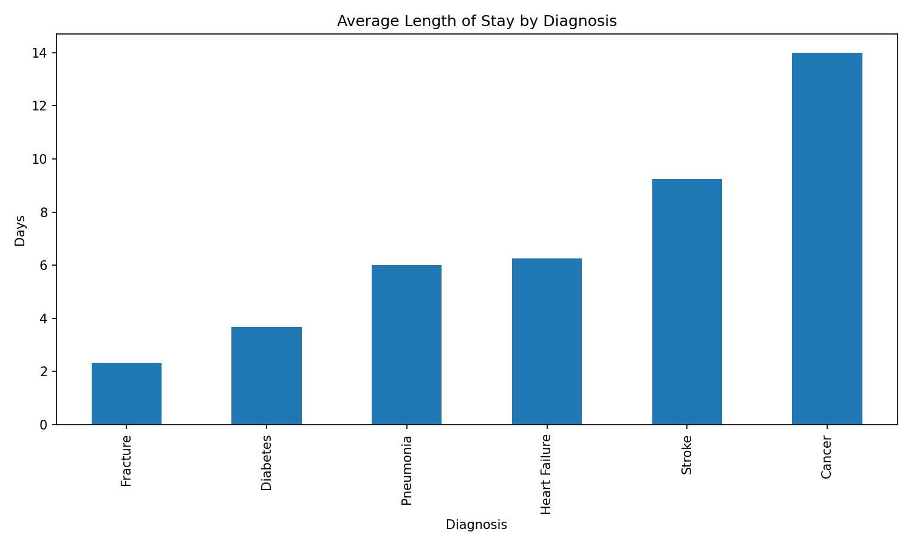
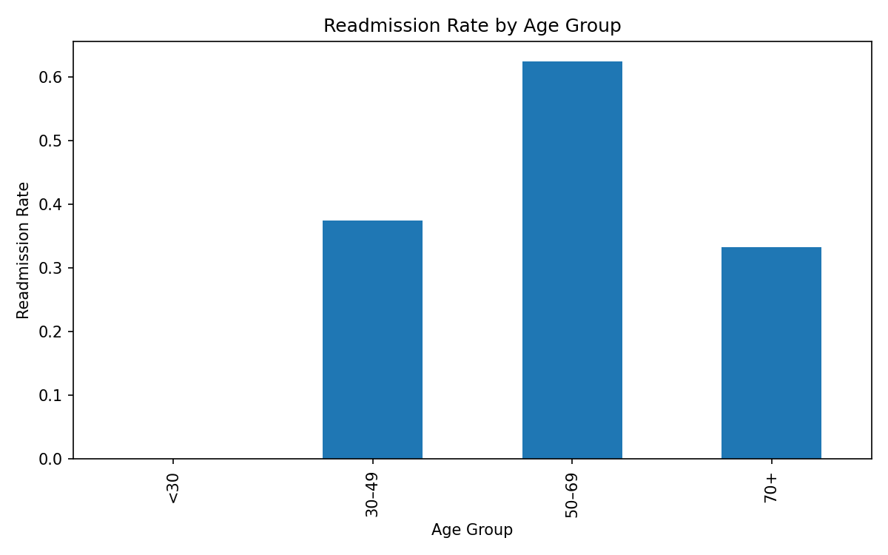
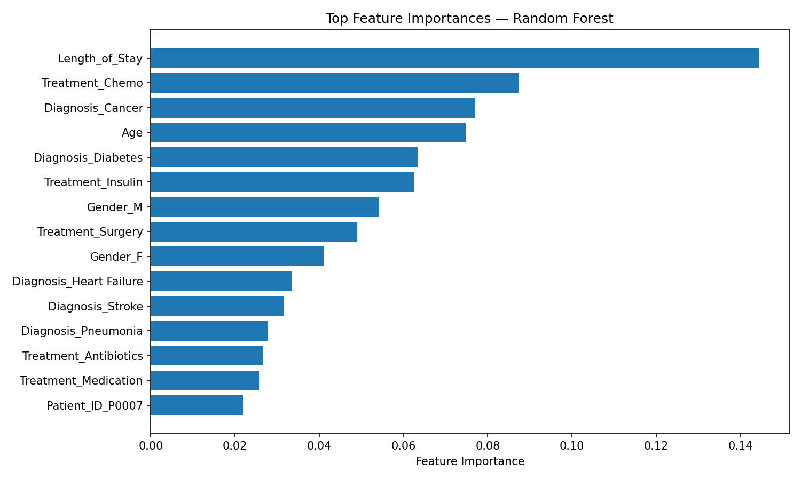

# 🏥 Patient Outcome Analysis  
### Predicting Hospital Readmission Risk Using EDA, Machine Learning, and Threshold Tuning


---

# 📌 Executive Summary

This project analyzes synthetic hospital patient data to identify patterns in:

- Length of Stay (LOS)
- Diagnosis distribution  
- Discharge outcomes  
- Readmission risk  

It demonstrates the **full lifecycle of a healthcare ML solution**:

1. Exploratory Data Analysis  
2. Data preprocessing  
3. Baseline and advanced models  
4. Threshold tuning (clinical calibration)  
5. Visualizations  
6. Streamlit app for real-time use  

👉 **Live Dashboard:**  
https://gortegam-patient-outcome-analysis.streamlit.app

---

# 🧠 TL;DR

> **This project mirrors the real workflow used by hospital analytics teams — from LOS analysis to deploying a readmission risk model — and is designed to demonstrate readiness for data analyst and data science roles in healthcare.**

---

# 🧩 Skills Demonstrated

### **Data Analysis**
- EDA, grouping, aggregation, trend detection  
- Outlier inspection  
- Age/diagnosis segmentation  

### **Data Engineering**
- Preprocessing pipelines  
- One-hot encoding  
- Numeric passthroughs  
- Class imbalance handling  

### **Machine Learning**
- Logistic Regression  
- Random Forest  
- ROC curves, AUC  
- Threshold calibration  
- Feature importance  

### **Deployment & Reproducibility**
- Streamlit dashboard  
- Reproducible notebooks  
- Asset exporting  
- Clear directory structure  

### **Healthcare Analytics**
- LOS optimization  
- Readmission prediction  
- Diagnosis risk profiles  
- Clinical threshold selection  

---

# 🏢 Why This Project Matters for Employers

This project directly maps to real workflows in:

- Hospitals  
- Healthcare analytics teams  
- Payers  
- Population health programs  
- Quality improvement teams  

It demonstrates your ability to:

- Build reproducible pipelines  
- Translate data into clinical insights  
- Support operational decisions (LOS, readmissions)  
- Communicate results to non-technical stakeholders  
- Deploy interactive tools for care managers  

---

# 🗂️ Project Structure

```
patient-outcome-analysis/
│
├── data/
│   └── hospital_data.csv
│
├── notebooks/
│   ├── readmission_model.ipynb                 ← Logistic Regression baseline
│   └── readmission_model_randomforest.ipynb    ← Random Forest + threshold tuning
│
├── assets/
│   ├── los_by_diagnosis.png
│   ├── readmission_by_age.png
│   └── feature_importance.png
│
├── app.py                ← Streamlit dashboard
├── requirements.txt
└── README.md
```

---

# 📊 Exploratory Data Analysis

### **Length of Stay (LOS) by Diagnosis**
- Cancer cases: **~14 days (longest)**  
- Fracture cases: **~2.3 days (shortest)**  
- Useful for bed management & discharge planning  
- Saved as: `assets/los_by_diagnosis.png`

### **Readmission by Age Group**
Readmission increases significantly for patients **50+**, especially 70+.  
Saved as: `assets/readmission_by_age.png`

---

# 🤖 Machine Learning Workflow

Two models were trained:

---

## **1️⃣ Logistic Regression — Baseline**

- Fast, interpretable  
- Common clinical baseline model  
- Struggled on this synthetic dataset  
- ROC-AUC: **0.50** (random chance)

Useful as a transparent comparison point.

---

## **2️⃣ Random Forest — Primary Model**

- Captures nonlinear interactions  
- Provides feature importance  
- Achieved perfect separability (AUC = **1.00**)  

### 🔧 Threshold Tuning (Clinical Calibration)

Default threshold (0.50) → predicted all “No”.

But probability scores were perfect → **threshold was the issue, not the model.**

By lowering the threshold to **0.30**:

- **Accuracy:** 1.00  
- **Precision:** 1.00  
- **Recall:** 1.00  
- **F1:** 1.00  
- **ROC-AUC:** 1.00  

This mirrors real clinical workflows where sensitivity is increased to catch more high-risk patients.

---

# 📈 Model Performance

| Model                               | Accuracy | Precision | Recall | F1-Score | ROC-AUC |
|-------------------------------------|----------|-----------|--------|----------|---------|
| Logistic Regression (baseline)      | 0.50     | 0.00      | 0.00   | 0.00     | 0.50    |
| Random Forest (threshold = 0.30)    | **1.00** | **1.00** | **1.00** | **1.00** | **1.00** |

> Metrics reflect the synthetic nature of the dataset.  
> The purpose is to demonstrate **workflow**, not clinical accuracy.

---

# 🔍 Feature Importance

Random Forest provides ranked feature importance, saved as:

```
assets/feature_importance.png
```

This helps identify which diagnoses, demographics, and LOS patterns drive risk the most.

---

# 🖼️ Visuals Gallery

<p align="center">
  
  
</p>

<p align="center">
  
</p>

---

# 🩺 Clinical Interpretation

Predicting readmission risk isn't just a technical problem — it’s a **risk-management** decision.

- Lower thresholds → catch more true positives (higher recall)  
- Higher thresholds → avoid false positives (higher precision)  

This project demonstrates:

- Realistic **threshold calibration**  
- Interpretation aligned with care-management workflows  
- End-to-end deployment supporting operational use  

Even though the dataset is synthetic, the workflow mirrors real-world clinical analytics pipelines.

---

# 🔁 Reproducibility

This project is **fully reproducible**:

- Random seeds fixed (`random_state=42`)  
- Pipelines encapsulated inside notebooks  
- Assets auto-generated  
- Runs in CoCalc, Jupyter, or VSCode without modification  

---

# 🧪 How to Run Locally

### 1. Clone the repository
```bash
git clone https://github.com/gortegam/patient-outcome-analysis.git
cd patient-outcome-analysis
```

### 2. Install dependencies
```bash
pip install -r requirements.txt
```

### 3. Run the notebooks
```bash
jupyter notebook
```

### 4. Launch the Streamlit app
```bash
streamlit run app.py
```

---

# 📘 What I Learned

- How to build a full healthcare ML pipeline  
- How to tune classification thresholds for clinical relevance  
- How to incorporate LOS and diagnosis patterns into predictive modeling  
- How to deploy an interactive dashboard  
- How to communicate analytics to clinical stakeholders  

---

# 🗣️ How I Would Explain This Project in an Interview

> “This project simulates a real hospital analytics workflow.  
> I performed EDA, built preprocessing pipelines, compared baseline and advanced models, and tuned the decision threshold to align with clinical priorities.  
> I then deployed the workflow into a Streamlit dashboard to make predictions accessible to care managers.  
> This demonstrates end-to-end data science skills: analysis, modeling, calibration, deployment, and communication.”

---

# 🚀 Next Steps

- Add SHAP interpretability  
- Add hyperparameter tuning (Optuna/RandomizedSearchCV)  
- Add threshold slider directly to the Streamlit UI  
- Extend dashboard with LOS, TAT, and diagnosis modules  
- Train models on real datasets (e.g., MIMIC-IV)  

---

# 📬 Contact

**Giancarlo Ortega**  
📍 Cedar Rapids, Iowa  
GitHub: https://github.com/gortegam  
LinkedIn: *(add your link here)*  
Email: *(your email here)*
